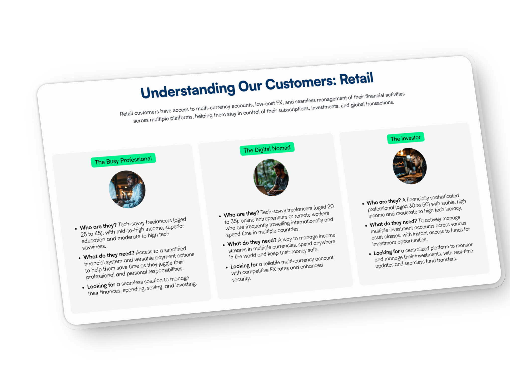
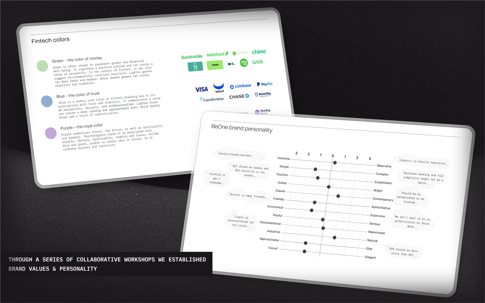
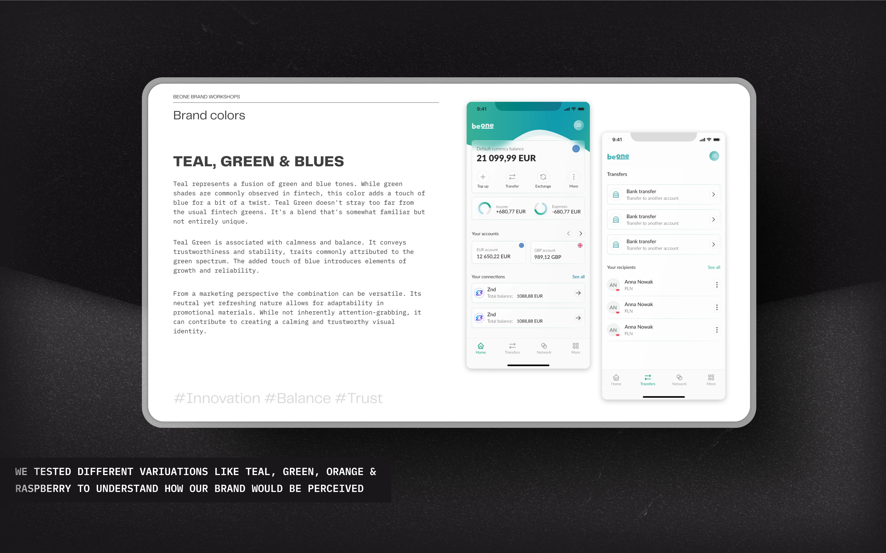

## The challenge

**BeOne is a next-generation neobank** — multi-currency accounts, low-cost FX, personal *and* business banking under one roof. Built for digital nomads, freelancers, and small businesses who need their financial life to behave like the rest of their life: fast, global, mobile.

The constraint that shaped everything: **we had to secure a banking licence**, and we had a fixed window to do it in. Regulators don't sign off on Figma wireframes. They want a clear product architecture and a polished interface that proves the team can actually run a bank.

That meant skipping a lot of what a 0→1 product team usually leans on — the long discovery loops, the wireframe rounds, the unhurried prototyping cadence. We had to **go straight to high-fidelity, brand-built, compliance-ready output** and trust the team's experience for the parts where we'd normally test our way forward.

The objectives I owned as Head of Design:

- Build a brand identity that signals trust *and* innovation — without picking one
- Design intuitive flows for onboarding, transactions, dashboard, and connections
- Stay tight with compliance and engineering so nothing we shipped tripped a regulatory wire
- Land a product story that holds personal *and* business banking in one ecosystem

## Approach

### Understand the opportunity
Stakeholder interviews — CEOs, financial advisors, fintech operators — to map the real pains. A competitor benchmark across the neobank space to see where the moats were. The gap kept showing up in two places: **transfer speed** and the **personal/business divide**. Most neobanks pick one. We wanted to dissolve the wall.

User research came in tight: surveys, interviews, behavioural patterns. Three personas crystallised — *The Digital Native* (freelancer integrating personal/business), *The Small Business Owner* (cash flow, expenses), *The Global Nomad* (multi-currency, FX rates). Every design call was tested against those three.

### Brand discovery
A focused workshop to set BeOne's core values: **freedom, reliability, ease of use**. Tested colour systems with users in remote sessions to confirm the values were *being read* — not just declared on a Notion page.

The visual identity landed on a vibrant palette and clean typography — energy and trust without picking corporate or playful. Both, deliberately.

### Feature prioritisation
With personas and benchmarks in hand, we ranked features hard. The MVP was about proving the ecosystem, not maxing out the surface area:

- A **unified dashboard** for personal and business finances (core)
- **Multi-currency accounts** with competitive FX (table stakes for our nomads)
- **Real-time transactions** with intuitive search and history
- **AI-powered insights** — out of MVP, in the roadmap

### UX and UI in parallel
Here's where the timeline got smart. We ran **two streams at once**: a UI kit + base component library on one track, UX flows and interaction analysis on the other. UI worked one sprint ahead so the components were ready when UX needed them. Both streams converged on four flagship flows — onboarding, dashboard, transactions, connections.

> Speed lesson from this project: when you don't have time for sequential discovery → design → handoff, **make the streams overlap by one sprint** and let the UI kit set the constraints UX writes against.

## What we built

**A presentable MVP for the regulator** — high-fidelity, interactive prototypes of the four flagship flows. Onboarding designed to be simple and guided, with clear progress to keep first-time anxiety low. Dashboard built as a modular overview of financial health, customisable. Transactions ordered intuitively with real-time updates. Connections visualised the B2B side as a relationship, not a list.

**A brand identity in production-ready form** — palette, typography, components, and microcopy register, all in the system, all consistent across surfaces. Built to read trustworthy at first glance and modern on the second.

**A working partnership with compliance and engineering** — workshops and transparent feedback loops kept design honest about what could ship under regulatory constraints, and kept engineering inside the design intent. Not a single late-stage rewrite because we'd designed something compliance couldn't sign off on.

## Outcome

**The licence was granted.** That's the only metric that mattered — and it shipped on time.

Underneath it: 300+ screens designed in six months, a fully tokenised UI kit, four flagship flows tested with real users, and a brand system the engineering team could actually build against. The proof-of-concept passed both the regulator and the internal exec gate.

## Reflection

A few patterns from this project I keep using:

**Time constraints drive focus.** A six-month deadline isn't a problem if you let it dictate priorities. We picked brand and high-fidelity flows over wireframes and over-research because that's what the regulator needed to see. Not every project gets to skip the cautious middle — but when one does, **trust the team's experience** for the parts you can't test your way through.

**Cross-functional collaboration is the cheat code.** The hardest part of a fintech 0→1 isn't the design — it's keeping product, design, compliance, and engineering in the same conversation. Workshops + open feedback channels did more for the timeline than any productivity tool.

**Leverage what already exists.** Mantine as the front-end base gave us a head start on the design system. Mobbin for flow study and pattern reference. Competitor benchmarks for core feature scoping. AI for technical review and handoff acceleration. None of these are excuses to skip thinking — they're scaffolding so we can spend our thinking on the parts that are actually new.

**Adaptability isn't optional.** Half the moves on this project were not in the plan — and the team had to keep clarity about what *was* the plan even while we cut things from it. That's a leadership job, not a design one.
