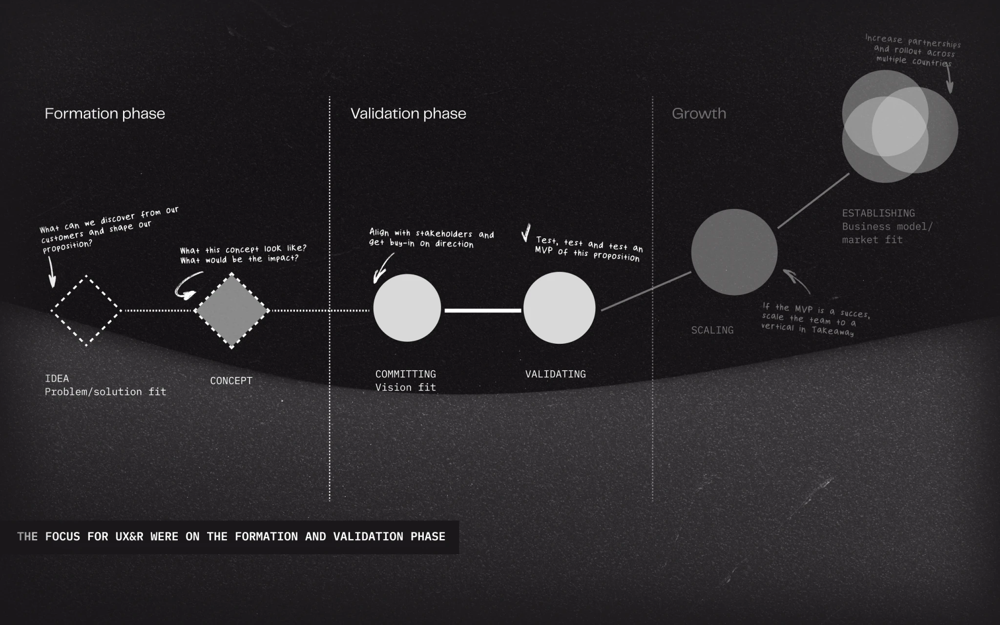
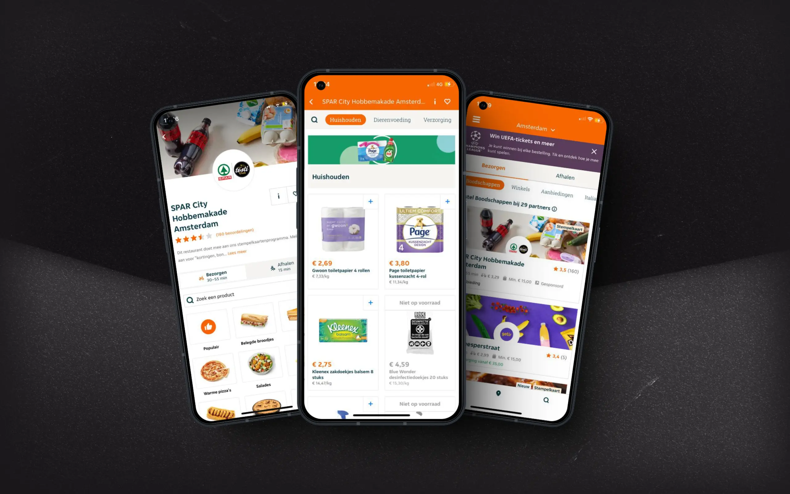
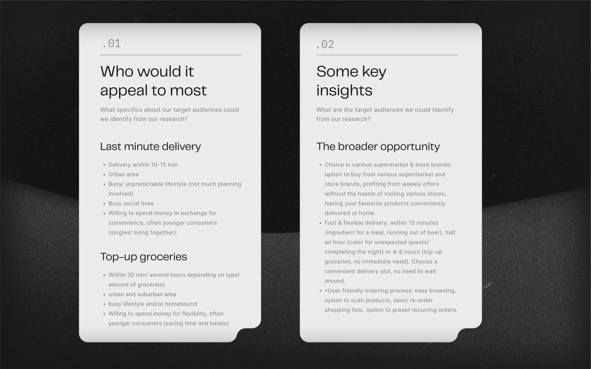
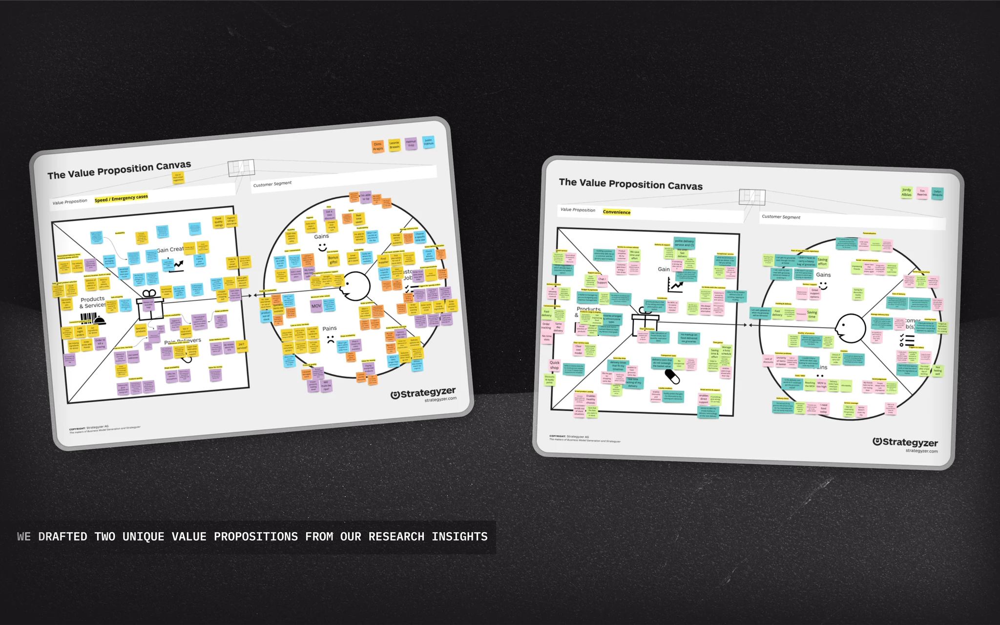

## The challenge

**Takeaway.com** moves over 1.1 billion food orders a year. While the restaurant business hummed, **Flink and Gorillas** were carving out an entirely new behaviour: 10-minute groceries on demand. The question on the table at JET wasn't *"should we do this?"* — it was *"is there a version of this that works for us, and if so, what is it?"*

The brief I worked from:

- Find out whether a grocery offering can **lift order frequency** among existing JET users
- Find out whether it can **differentiate enough** to compete with the dedicated flash-grocery players
- Do all of the above **without rebuilding our logistics and marketplace model from scratch**

Underneath: **don't burn the restaurant business while you're testing a new vertical**. JET's whole identity, infrastructure, and operator partnerships are restaurant-shaped. A grocery experiment had to fit that, not fight it.

## Approach

### Validate the opportunity
The seed came from a joint research study between **Unilever and JET** that flagged ice-cream as a missing category — and behind it, the wider grocery space. We took that signal and stress-tested it.

Two market studies in **England and Germany** with 4 focus groups — 2 urban, 2 suburban / rural; half were already shopping groceries online, half were considerers. The question we needed answered wasn't *"do people buy groceries?"* — it was *"what need-state is online grocery actually serving, and what would they expect from JET if we showed up?"*

### Test the concept (cheap)
Research surfaced four candidate propositions. We ran a **risk assessment with Partners & Logistics** — and the realistic option came out as a **single-partner play** rather than a multi-vendor marketplace. Multi-vendor logistics couldn't reliably hit our delivery promises. So we picked **Albert Heijn**, the largest grocer in the Netherlands, as the testing partner.

Then the move that mattered most for the timeline: **a fake-door test in the live app**. A "Groceries" menu item, no real backend behind it. CTR landed at **16% among 16–25-year-olds** — the highest of any menu category.

> That test cost almost nothing and answered the only question the board needed answered. **Cheap evidence beats expensive opinions.** Without that 16% number, the MVP doesn't get green-lit.

### Build & launch the MVP
Live test in select Dutch and German cities, with Albert Heijn handling the inventory and JET owning delivery. Our edge was *speed*: under 20 minutes from order to door, using **only JET-contracted couriers** so we could actually keep the promise.

Two metrics to watch: **adoption** and **delivery-time feasibility**.

## What we built

**A live grocery flow inside the existing JET app.** Order, checkout, and tracking all reused our restaurant patterns — same mental model for users, minimal lift for engineering. Differences sat where they had to: cart behaviour, item granularity, basket-size handling.

**A partner-owned inventory model.** No JET dark stores, no JET warehousing. Albert Heijn handled stocking and picking; JET handled delivery. The economics worked because we weren't capitalising the long tail.

**A 20-minute promise that operations could actually back.** Built by limiting couriers to the JET-contracted pool only and routing groceries differently from restaurant orders.

**Edge-case handling that surfaced from the MVP.** We discovered partners weren't pre-picking orders fast enough to hit our delivery window — so we shaped a **separate order-management dashboard** on the partner side. We hit the *"basket weighs more than one courier can legally carry"* problem and had to design rules around that. Both went into the next iteration.

## Outcome

The numbers from the MVP made the call easy:

- **63%** of our target customers placed at least one grocery order in the trial — instant traction
- Groceries became **12%** of all platform orders during the pilot — without cannibalising restaurant volume
- Average grocery order value was **€27** vs **€19** for restaurants — bigger baskets, better unit economics
- **Active user base grew 9%** during the MVP phase

The trial scaled from Amsterdam to nation-wide rollout. Customer feedback pointed sharply at **delivery speed** as the differentiator they cared about — restaurant-grade speed, not supermarket speed — which set the agenda for the next iteration: improve partner-side picking and handling.

## Reflection

A few things I keep using from this work:

**Cheap evidence beats expensive opinions.** A fake-door test with no real backend gave the business a 16% CTR — and that was the entire green-light for the MVP. Most of the meetings I sat in *before* that test were arguments about whether to build something we hadn't proven anyone wanted.

**Pick the model, not just the product.** Multi-vendor was the seductive marketplace play. Single-partner was the one that could actually keep its delivery promise. The choice that mattered most wasn't a UI choice.

**Restaurants are the brand. Don't burn them.** Every design call had to keep restaurant ordering intact — same flow logic, same speed expectations, same trust. Groceries earned its place by reusing JET's existing patterns, not asking customers to learn a new app inside the app.

**Read the competitive landscape with a strategy lens, not a fear lens.** Our research showed the flash-grocery economics were unworkable from day one — JET's competitors *vanished*. Flink, the main one, is now a JET platform partner. Groceries is a thriving vertical inside JET's ecosystem. The same vertical that, in 2021, looked like an existential threat.
