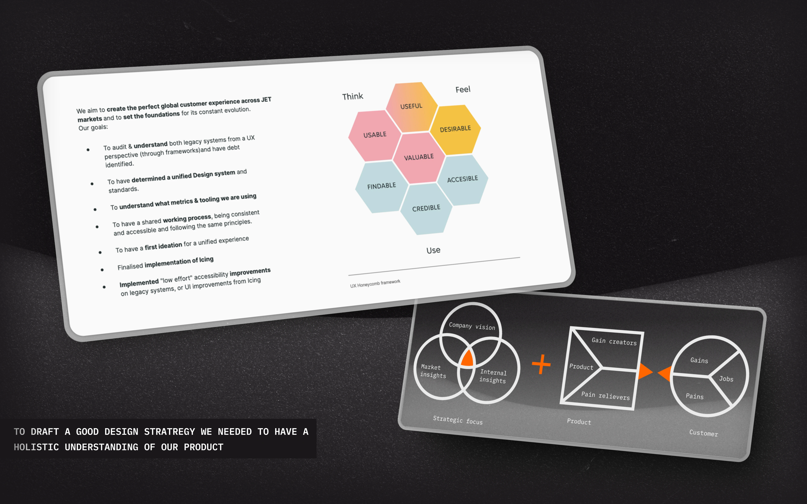
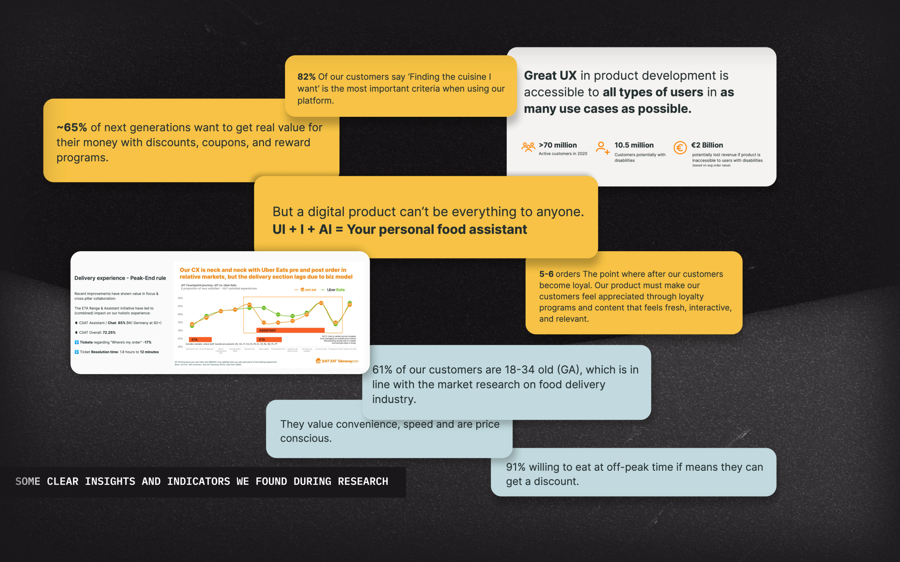

## The challenge

**Just Eat Takeaway** is the result of a merger of *Just Eat* and *Takeaway.com* — two companies, two product cultures, twenty-two markets, one consumer brand trying to behave like one product. I came in as **interim Head of Product Design** during the integration, with a brief that started broad: *"improve user experience and drive growth."*

That brief needed sharpening. UX wasn't going to differentiate JET on *food* — every player has food. **The thing JET could actually own was the experience.** That was the strategic bet I had to make legible to the business — and to the design org I'd inherited.

## Approach

Three frames — *assess*, *vision*, *how* — pulled loosely from **Radical Product Thinking** and the **InVision maturity scale**:

- **Where are we now?** — assess
- **Where do we want to be?** — vision
- **How do we get there?** — themes & milestones

A series of stakeholder interviews and cross-market workshops fed each frame. The design managers (4) and principals (2) ran them with me — the strategy had to be *theirs* by the time it shipped, not mine.

### Where are we now?

We placed JET at **Level 2 of the InVision Design Maturity Scale** — design was *involved* but not *leading*. The diagnostic ran across five inputs:

- **Business analytics** — retention, AOV, support tickets, delivery times across markets
- **User research** — interviews and usability sessions surfacing pain points along the journey
- **Customer-support data** — recurring tickets and FAQs as a signal of where the experience breaks
- **Market & trend research** — sector shifts, emerging tech, changing consumer behaviour
- **Competitor analysis** — the gaps in everyone else's offer

The clearest signal landed in a stakeholder workshop: *"the food itself doesn't make us unique — the experience will."* That's the line the strategy had to underwrite.

### Where do we want to be?

Three workshops to synthesise. We pulled themes, plotted them on impact × feasibility, and let the messy middle collapse into **three pillars**:

**1 · Personalization** — data-driven recommendations and tailored experiences. Repeat-order data was clear: when we showed people *their* food, they ordered more.

**2 · Omnichannel experience** — one journey across devices and touchpoints. The merger made this non-optional — two product cultures, one customer.

**3 · Design excellence** — the org-side pillar. A unified design system, a Voice-of-Customer program, continuous-discovery rituals, scaled craft. From *Design Leadership Ignited*: design becomes a strategic function or it doesn't.

### How do we get there?

Vision statement, drafted using **Radical Product Thinking**:

> *"Design excellence through data-driven, personalised, and omnichannel experience."*

**North Star metric:** orders delivered successfully. **Supporting framework:** Google's **HEART** model — Happiness, Engagement, Adoption, Retention, Task success — applied across the consumer vertical so each pillar had measurable downstream signals, not just vibes.

## What we built

**A strategy the org could execute against, not just admire.** Three pillars, North Star + HEART, and a roadmap with clear ownership — rather than a deck that lived on a Confluence page.

**A unified design system — PIE.** Shipped as the cross-market consistency play, with a dedicated team to maintain it. Accessibility-first from day one — not ethical theatre, but a measurable revenue tail in markets where compliance was tightening.

**A specialised team structure.** A platform team and an accessibility team carved out from existing capacity, plus a Voice-of-Customer program that gave research a continuous channel into product, not a one-off study cadence.

**A culture of experimentation.** Continuous-discovery rituals — weekly interviews, evidence-driven planning, AI-assisted synthesis later — became the way product decisions got made.

## Outcome

- **InVision maturity moved from Level 2 to Level 3.** Stronger UX integration in business strategy, more data-driven decisions, design at the table where it had been an afterthought.
- **PIE shipped** as the cross-market design system, with a dedicated team owning it.
- **Accessibility became a default, not a project.** A standing team, a place in every release checklist.
- **The strategy outlasted me.** JET hired a permanent Design Director who took the same three pillars forward and has been building on them since. That was the real test — does it survive the handoff?

## Reflection

**Strategy is downstream of organisational truth-telling.** The merger created a story problem before it created a UX problem. Naming *"the experience is what makes us unique"* gave product, design, and the business a shared sentence to plan against. Without that line, no roadmap would have aligned 22 markets.

**Pick frameworks, don't worship them.** InVision's maturity scale, Google's HEART, a couple of leadership books — none of them is the answer. Together they made a coherent enough story for a board to fund. The strategy that survives is the *combination*, not the lift.

**The metric that aligns is the metric that ships.** *"Orders delivered successfully"* is unglamorous, but every market, every team, every stakeholder agreed on what it meant. HEART filled in the texture underneath without diluting it. A North Star you can argue with isn't a North Star.

**Design excellence is org work, not craft work.** PIE, the accessibility team, the VoC program — those are the things that scaled UX. The pixels are downstream. If you want design to mature, ship the structure.
