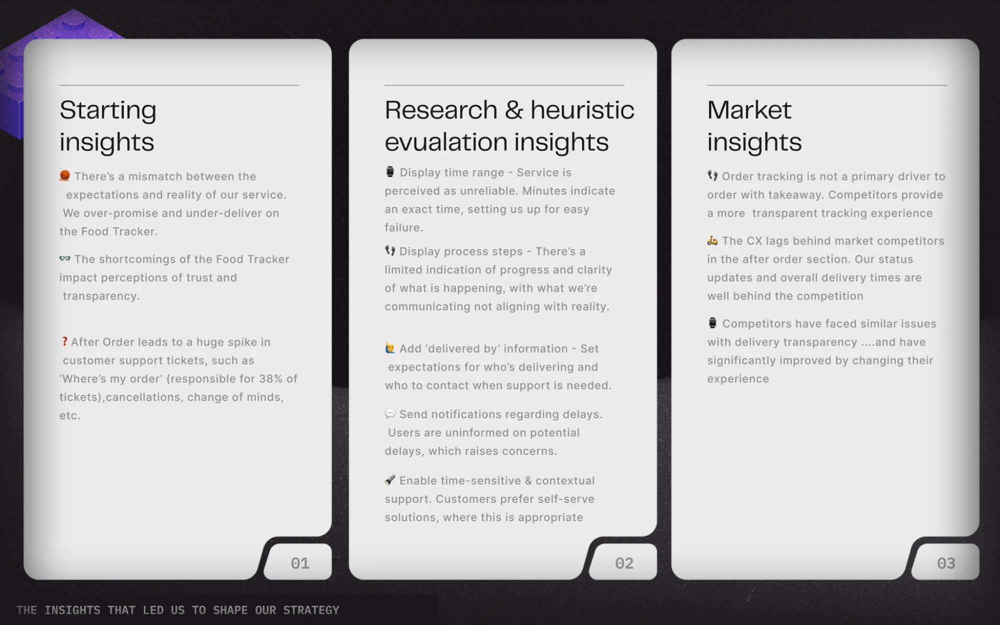
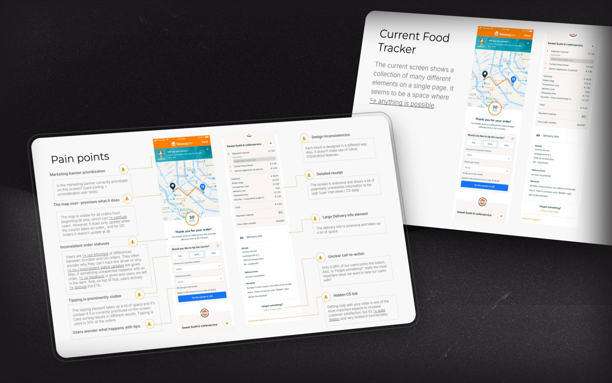
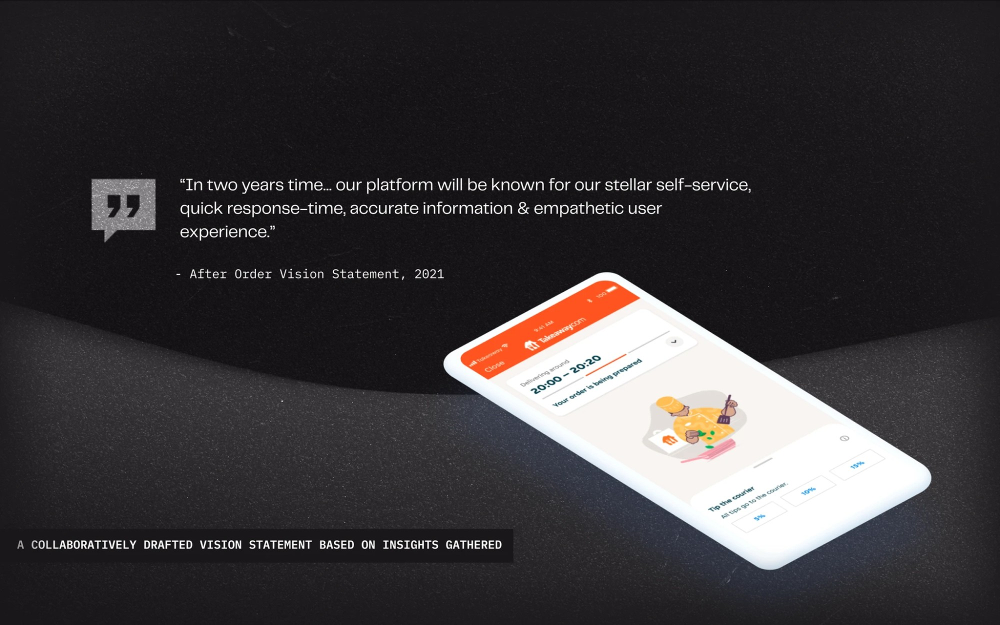

## The challenge

The After Order phase at Just Eat Takeaway hadn't been revisited for **over three years**. Ownership was ambiguous, there was no product vision for the space, and the team had drifted into an iteration-led loop — small ticket-driven tweaks, no strategic direction. Customers were confused and frustrated; support tickets were the loudest symptom.

The brief, framed as how-might-we's:

- How might we decrease negative sentiment around unreliability and create a lovable experience?
- How might we uncover and communicate information more clearly?
- How might we give users a sense of control — and support them when they need it?
- How might we reduce support contact rates?

What I had to deliver underneath those questions: **a strategic vision and a redesigned post-order experience for one of the most-touched moments in JET's funnel**, owned by a team that didn't yet exist.

## Approach

### Form the team
Assembled a mixed crew — 3 product designers, a UX writer, a researcher, and product owners. Aligned on the domain, expectations, and what "good" looked like before we shipped a single frame.

### Discover
Competitor teardowns, exploratory research, user interviews. Mapped the customer journey end-to-end and pulled out the pain points that were actually causing the calls — not the ones the team assumed were causing them.

### Frame with stakeholders
Two hackathon days with customer support and logistics. Workshops to align on the problems and the objectives. Stakeholder management was a big chunk of the role here — the space had been neglected long enough that everyone had a different idea of what it was for.

### Future-state first
Designed the future state before we negotiated the trade-offs. Showing what the space could be — informed by the research — turned arguments about scope into conversations about sequencing. **Stakeholder buy-in landed faster when we led with a vision, not a backlog.**

### Prototype and test
Iterated through design sprints focused on the high-leverage moments (food tracker, support entry points). Prototypes, user testing, A/B tests. Each round fed back into the next sprint.

## What we built

A structured After Order experience, broken into the phases that actually matter: **pre-confirmation, in delivery, post-delivery** — each one with information and support tailored to where the order is and what the customer needs to feel.

**Contextual status updates** that explain *why*, not just *what*. Drivers run late — say so, and say what we're doing about it.

**A reassured timeline.** We dropped the precise minute countdown that was setting customers up to be disappointed every time. Replaced it with a confidence range that the operations side could actually back. Counter-intuitive change, big trust dividend.

**Stage-aware support visibility.** The right help, surfaced at the right moment. Self-service for the things customers can resolve themselves; a clear human route for the things they can't.

**Empathetic messaging and concrete CTAs.** Rewrote the language top-to-bottom with the UX writer. Less platform-speak, more useful-friend.

> Big lesson: the cheapest support ticket is the one a customer never needs to write because the product told them what they wanted to know, when they wanted to know it.

## Outcome

CSAT up 13% to 86.52% overall. NPS up 10 points. Support tickets related to order inquiries down 18%. Average resolution time collapsed from **120 minutes to 9** — partly because the better self-service intercepted simpler tickets, partly because the ones that did reach the team arrived with cleaner context.

## Reflection

A few things this work re-confirmed for me:

- **Cross-functional early beats cross-functional late.** Pulling support and logistics into the framing — not the review — is the only way to get out of the iteration-led loop.
- **User-centred isn't a slogan, it's a cadence.** Continuous research feeding continuous sprints is the only test that catches whether the product is actually getting better.
- **Contextual communication is a feature.** What you say at minute three of a delivery is a different product from what you say at minute thirty.
- **Iteration with conviction.** The design sprint cadence worked because every loop had a point of view, not just a backlog.

A non-product outcome that mattered to me: this work created the room to **promote two designers on the team**. The space went from neglected to strategic, and that lifted the people working in it too.
