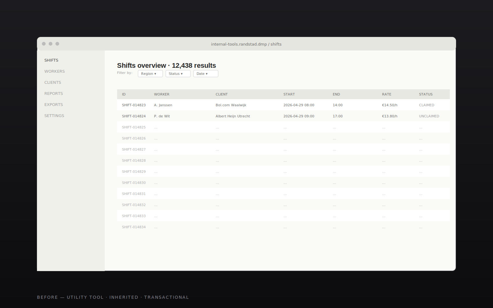
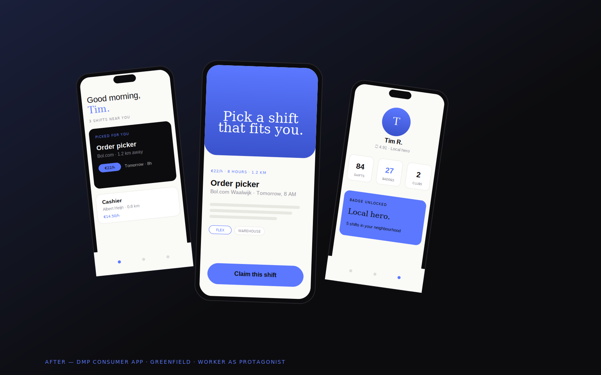
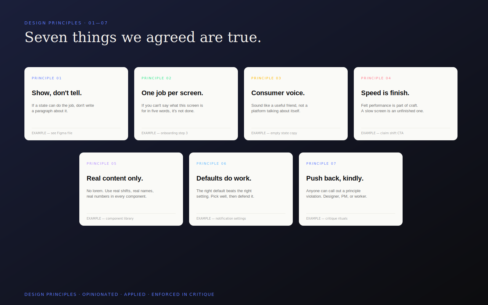

> **[Working draft — Tim to refine.]** Numbers and a few specifics are placeholders to show the shape; replace with the real ones before the case ships.

## The challenge

I joined Randstad Global as Product Design Lead in 2026 to take an old idea — a flexible-work app for shift workers — and rebuild it into something people would actually want to open on their phone.

The starting point was an internal utility tool. It worked, it was functional, and it looked the part: a transactional app for picking up shifts. It treated workers like a queue.

The brief inside the building was *"refresh the app"*. The brief I came in with was different: **rebuild it from scratch as a consumer-grade product**. Same audience, same job-to-be-done, but a fundamentally different design posture — one where the worker is the customer, not a unit of supply.

That meant three big shifts had to happen at once:

- A **greenfield product surface** — DMP from a blank canvas, not retrofitted onto the old utility codebase
- A **branding conversation** — convincing Randstad's brand and exec layer that this should be positioned and treated as a consumer app, not an internal tool with a Randstad logo on it
- A **lift in UI craft** — pixel-level work that signals "this is a product made for me", not "this is a system someone made for HR to track me"

And — because I joined to do this in 2026 — all of the above had to be built into AI-augmented workflows. The team had to ship at consumer-product speed without losing consumer-product polish.

## Approach

### Reframe the product
Started with stakeholder conversations across product, brand, marketing and the workforce side. Mapped the friction between *"this is HR software"* and *"this is a consumer app"*. Made the case — with research and competitive teardowns — that workers don't separate "tools my employer made me use" from "apps I open on my phone". They compare us to the things on their home screen.

### Convince branding
Built and ran a working session with the brand team and execs. The output was a shared positioning frame: **the app is a consumer surface that happens to be powered by Randstad**, not the other way around. That single decision unlocked everything downstream — visual language, copy register, what we *don't* show, what onboarding feels like.

### Write the principles
Co-authored 7 design principles with the team. Concrete, opinionated, and applied — not framed art. Each one comes with a *do this, not that* example, a screenshot from the product, and a permission to push back if the principle isn't being honoured. The principles became the rubric for critique and review.

### Build the UI standard
Set a high bar on UI craft from the first frame. A token system that maps to the rebrand. Components built around real content, not lorem. Motion, density, type scales — owned, documented, and enforced. Designers spend the saved AI-augmented time on this, not on production rote.

### Wire AI into the loop
Discovery, exploration and refinement now run with AI in the loop — research synthesis, copy variants, IA scaffolding, component generation against the design system. Critique includes an AI co-critic pass before the human conversation. Time saved goes back into craft, not throughput.

> The lesson I keep returning to: **AI doesn't replace craft, it pays for it.** Every hour the model takes off the production pile is an hour the team can spend on the parts of the product that make people choose it.

## What we built

**A consumer-grade DMP app, from scratch.** Greenfield surfaces — onboarding, home, shift discovery, shift management, profile, chat — built around the worker as the protagonist. Not a re-skin. A new product.

**Seven design principles, lived not laminated.** A short, opinionated set: things like *show, don't tell* (avoid copy where a state can do the job), *one job per screen*, *consumer voice over corporate voice*, *speed is a feature, not a finish*. Used in every critique. Pinned in every Figma file.

**A UI craft bar.** Type, density, motion, microcopy, illustration — held to consumer-app standards. Components built with real worker content, real shift names, real names from research, not placeholder strings. The bar is enforceable because every designer can point at the tokens.

**AI-augmented design rituals.** Weekly critiques include an AI co-critic. A team Prompt Vault for synthesis, IA, and component scaffolding prompts. Discovery cycles roughly halved without losing rigour.

**A consumer-app brand position.** Not a marketing artefact — an internal alignment that means we now have permission to design *for the worker*, with the brand as the engine, not the front door.

## Outcome

Early signal is strong. The app is shipping greenfield surfaces faster than the legacy utility app ever could. Workers in research are reading us as a consumer product, not a utility. The principles are surviving contact with execution — designers are pushing back on PMs and on each other using them, which is the only test that matters.

[Tim — drop the real NPS, ship velocity, and any conversion deltas here.]

## Reflection

A few things I keep learning on this work:

1. **The biggest design move was a positioning decision.** Once "this is a consumer app" was true at the leadership level, every subsequent design call got easier. Without it, every detailed UI argument turns into a litigation of first principles.

2. **Greenfield is a craft opportunity, not a craft excuse.** Starting from scratch is the moment to set the bar — not the moment to ship faster because nothing's there yet.

3. **AI is leverage on the right team.** On a team that doesn't know what excellence looks like, AI just produces a higher volume of mediocre output. On a team that does, it's the cheat code of the decade.

What's next:

- Push the worker experience deeper into community, reputation, and growth — the hooks that turn a transactional app into a daily one
- A design-system-aware AI agent that scaffolds flows directly from the live token graph
- Continue lifting the principles into observable behaviour at the product layer (what do we measure that proves "consumer voice over corporate voice" is happening?)

